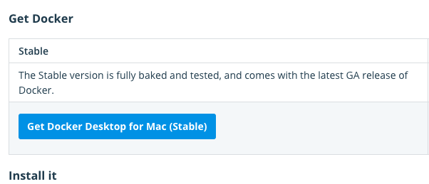
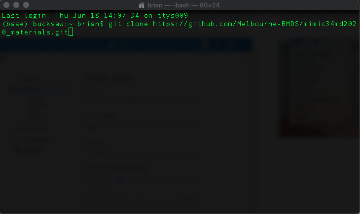
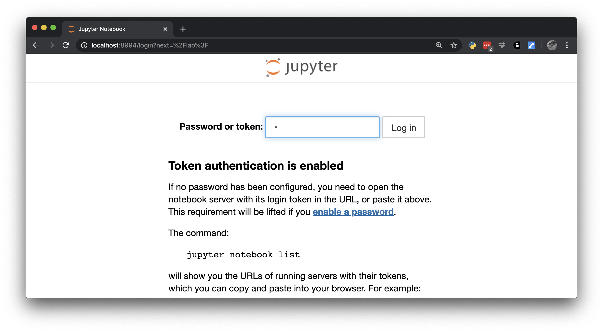

# Setting up the Environment on Your Home Computer

Because we can only keep the environment up for a limited time in the Melbourne Research Cloud, you may be interested in replicating the environment on your own computer. In principle this is not difficult. However, it can be problematic on Windows PCs if you are using a student version of Windows, which may have virtualization disabled. The instructions that follow are for Mac users.

1. Install [Docker](https://docs.docker.com/get-docker/)
    - Select the Docker Desktop for Mac
    - Install the **Stable version**

1. Start Docker
    - You can configure Docker to start when your computer books. Docker does, however, consume a lot of computer resources, so you may not want this. When Docker is running, you should see the Docker logo (a whale) in your menu bar (red arrow below).

1. Clone the `mimic34md2020_materials` repository on your computer:
    - There are GUI tools for this, but I use the command line.
    - Open the `terminal` application on your computer. I do this by typing `terminal` in `Spotlight`
    - In the terminal type
```bash
git clone https://github.com/Melbourne-BMDS/mimic34md2020_materials.git
```

1. In your terminal, change directory to `mimic34md2020_materials/docker/data`
1. Download the data from the ["Predicting Mortality of ICU Patients --- The PhysioNet Computing in Cardiology Challenge 2012"](https://physionet.org/content/challenge-2012/1.0.0/)
    - Uncompress the file in the `mimic34md2020_materials/docker/data` directory. This can be done either with the command line `unzip` or through `Finder.`
1. Change directory to `mimic34md2020_materials`
1. The `docker-compose.yml` defines the environment

```Yaml
version: '3'
services:
  jupyter:
    image: "chapmanbe/mimic34md_jupyter:latest"
    ports:
      - "8994:8888"
    environment:
      - JUPYTER_TOKEN=mimic34md
      - JUPYTER_ENABLE_LAB=yes
      - USE_HTTPS=yes
    volumes:
      - "${PWD}/..:/home/jovyan/code"
      - "${PWD}/data:/home/shared"
```

This is invoked with the command

```Bash
docker-compose up -d
```

This will pull the image "chapmanbe/mimic34md_jupyter:latest" from DockerHub. This image will create a Docker container (computing environment) that is serving a JupyterLab environment at `localhost:8994`.

It also mounts the `data` and (`../`) parent directory to `/home/shared` and `/home/jovyan/code` respectively.

The JupyterLab environment is protected by the password set with  `JUPYTER_TOKEN`.



## Alternative

The image we are using was created using the Dockerfile contained in the `Jupyter` directory. You can change the Dockerfile as desired and use this new definition for the environment.
To do so edit `docker-compose.yml` as follows:

```Yaml
version: '3'
services:
  jupyter:
    build: Jupyter
    ports:
      - "8994:8888"
    environment:
      - JUPYTER_TOKEN=mimic34md
      - JUPYTER_ENABLE_LAB=yes
      - USE_HTTPS=yes
    volumes:
      - "${PWD}/..:/home/jovyan/code"
      - "${PWD}/data:/home/shared"
```

Executing

```bash
docker-compose build
```

will build a new image based on the Dockerfile.

Then

```bash
docker-compose up
```

will start the environment.
